# 🔐 Architettura di Autenticazione - Recipe Forum

## 📋 Indice

1. [Overview dell'Architettura](#overview-dellarchitettura)
2. [Core Libraries & Foundation](#core-libraries--foundation)
3. [Hooks Layer](#hooks-layer)
4. [Providers Layer](#providers-layer)
5. [Components Layer](#components-layer)
6. [Flusso di Autenticazione](#flusso-di-autenticazione)
7. [Vantaggi dell'Architettura](#vantaggi-dellarchitettura)
8. [Pattern e Best Practices](#pattern-e-best-practices)
9. [Guida all'Uso](#guida-alluso)

---

## 🎯 Overview dell'Architettura

Il sistema di autenticazione di Recipe Forum è progettato con una **architettura a layer** che separa chiaramente le responsabilità e massimizza la riusabilità del codice.

### 🏗️ Struttura a Layer

```
┌─────────────────────────────────────────┐
│              UI Components              │  ← User Interface
├─────────────────────────────────────────┤
│               Providers                 │  ← State Management
├─────────────────────────────────────────┤
│                Hooks                    │  ← Business Logic
├─────────────────────────────────────────┤
│            NextAuth.js                  │  ← Authentication Core
└─────────────────────────────────────────┘
```

### 📁 File Structure

```
src/
├── hooks/
│   └── useAuth.js                    # 🎣 Hook principale autenticazione
├── providers/
│   ├── AuthModalProvider.js          # 🎭 Gestione modal UI
│   ├── SessionProvider.js            # 👤 Sessione NextAuth
│   └── Providers.js                  # 🔧 Provider combinato
├── components/auth/
│   ├── SocialLogin.jsx               # 🌐 Login GitHub/Google
│   ├── LoginButton.jsx               # 🔑 Pulsante apertura login
│   ├── LogoutButton.jsx              # 🚪 Pulsante logout
│   ├── LoginModal.jsx                # 📝 Modal form login
│   ├── SignUpModal.jsx               # 📋 Modal form registrazione
│   └── ProtectedRoute.jsx            # 🛡️ Protezione route
└── lib/
    └── auth.js                       # ⚙️ Configurazione NextAuth
```

---

## 🧱 Core Libraries & Foundation

### NextAuth.js - Il Cuore del Sistema

**Cosa fa:**
- Gestisce sessioni utente in modo sicuro
- Integra provider social (GitHub, Google)
- Gestisce JWT tokens e cookies
- Fornisce callbacks per personalizzazione

**Perché è utile:**
- ✅ **Sicurezza built-in** → Non devi implementare JWT/cookies manualmente
- ✅ **Multi-provider support** → Social + credentials in una sola libreria
- ✅ **Production-ready** → Usato da migliaia di app
- ✅ **Zero config** → Funziona out-of-the-box

**Configurazione (`src/lib/auth.js`):**
```javascript
export const authOptions = {
  providers: [
    GitHubProvider({ ... }),    // Login GitHub
    GoogleProvider({ ... }),    // Login Google
    CredentialsProvider({ ... }) // Email/password
  ],
  callbacks: {
    signIn: async ({ user, account }) => { ... },
    session: async ({ session, token }) => { ... }
  }
}
```

---

## 🎣 Hooks Layer

### useAuth.js - L'Hook Principale

**Scopo:** Fornire un'interfaccia semplificata per tutte le operazioni di autenticazione.

**Cosa fa:**
```javascript
export function useAuth() {
  const { data: session, status } = useSession();
  
  return {
    user: session?.user || null,           // Dati utente corrente
    isAuthenticated: !!session,            // Boolean: loggato?
    isLoading: status === "loading",       // Boolean: caricamento?
    status,                                // Stato dettagliato
    login: (provider, options) => signIn(provider, options),   // Funzione login
    logout: (options) => signOut(options), // Funzione logout
  };
}
```

**Perché è utile:**

1. **Astrazione Semplice:**
   ```javascript
   // ❌ Senza hook (ripetitivo)
   const { data: session, status } = useSession();
   const isAuth = session && session.user;
   const isLoading = status === "loading";
   
   // ✅ Con hook (clean)
   const { user, isAuthenticated, isLoading } = useAuth();
   ```

2. **API Consistente:**
   - Tutti i componenti usano la stessa interfaccia
   - Facile da testare e mockare
   - Zero boilerplate nei componenti

3. **Type Safety:**
   - Converte `session` nullable in boolean `isAuthenticated`
   - Evita errori `session?.user?.property`

**Esempio d'uso:**
```javascript
function MyComponent() {
  const { user, isAuthenticated, login, logout } = useAuth();
  
  if (isAuthenticated) {
    return <div>Ciao {user.name}! <button onClick={logout}>Esci</button></div>;
  }
  
  return <button onClick={() => login('github')}>Accedi con GitHub</button>;
}
```

---

## 🎭 Providers Layer

### AuthModalProvider.js - Gestione Modal UI

**Scopo:** Centralizzare lo stato di apertura/chiusura dei modal di autenticazione.

**Cosa fa:**
```javascript
export function AuthModalProvider({ children }) {
  const [isLoginOpen, setIsLoginOpen] = useState(false);
  const [isSignupOpen, setIsSignupOpen] = useState(false);

  const value = {
    isLoginOpen,        // Boolean: modal login aperto?
    isSignupOpen,       // Boolean: modal signup aperto?
    openLogin: () => setIsLoginOpen(true),      // Apri login
    closeLogin: () => setIsLoginOpen(false),    // Chiudi login  
    openSignUp: () => setIsSignupOpen(true),    // Apri signup
    closeSignUp: () => setIsSignupOpen(false),  // Chiudi signup
  };

  return (
    <AuthModalContext.Provider value={value}>
      {children}
    </AuthModalContext.Provider>
  );
}
```

**Perché è utile:**

1. **Stato Globale Semplice:**
   ```javascript
   // ✅ Da qualsiasi componente
   const { openLogin } = useAuthModal();
   return <button onClick={openLogin}>Accedi</button>;
   ```

2. **Coordinamento Modal:**
   - Solo un modal aperto alla volta
   - Switch facile tra login/signup
   - Chiusura centralizzata

3. **Zero Prop Drilling:**
   ```javascript
   // ❌ Senza provider
   <App>
     <Navbar onOpenLogin={openLogin} />
     <Hero onOpenLogin={openLogin} />
     <Footer onOpenLogin={openLogin} />
   </App>
   
   // ✅ Con provider  
   <AuthModalProvider>
     <App>
       <Navbar /> {/* usa useAuthModal() */}
       <Hero />   {/* usa useAuthModal() */}
       <Footer /> {/* usa useAuthModal() */}
     </App>
   </AuthModalProvider>
   ```

### Providers.js - Provider Combinato

**Scopo:** Combinare tutti i provider necessari in un unico componente per il layout.

```javascript
export function Providers({ children, session }) {
  return (
    <SessionProvider session={session}>      {/* NextAuth sessioni */}
      <AuthModalProvider>                     {/* Modal state */}
        {children}
      </AuthModalProvider>
    </SessionProvider>
  );
}
```

**Vantaggi:**
- Layout pulito: `<Providers>{children}</Providers>`
- Ordine corretto dei provider
- Easy to extend con nuovi provider

---

## 🎨 Components Layer

### 1. SocialLogin.jsx - Login Social

**Scopo:** Pulsanti per login con GitHub e Google.

**Features:**
- Icone SVG ufficiali dei brand
- Loading state durante autenticazione
- Callback personalizzabile al successo
- Layout responsive

**API:**
```javascript
<SocialLogin 
  showText={true}                    // Mostra testo o solo icone
  className="mb-6"                   // Classi CSS aggiuntive
  onSuccess={(provider) => {         // Callback successo
    console.log(`Login ${provider} completato`);
    closeModal();
  }}
/>
```

**Perché è utile:**
- ✅ **Brand Compliance** → Icone e colori ufficiali
- ✅ **UX Consistency** → Stesso design ovunque
- ✅ **Zero Boilerplate** → `onClick={() => login('github')}` già gestito

### 2. LoginButton.jsx - Trigger Login

**Scopo:** Pulsante che apre il modal di login.

**Features:**
- Varianti styling (primary, secondary, outline)
- Dimensioni multiple (small, medium, large)
- Auto-hide se utente già loggato
- Loading state integrato

**API:**
```javascript
<LoginButton 
  variant="primary"                  // Stile button
  size="medium"                      // Dimensione
  className="mr-4"                   // CSS extra
>
  Entra nel Forum
</LoginButton>
```

**Smart Logic:**
```javascript
// Si nasconde automaticamente se già loggato
if (isAuthenticated) return null;
```

### 3. LogoutButton.jsx - Trigger Logout

**Scopo:** Pulsante per il logout con conferma opzionale.

**Features:**
- Conferma opzionale prima del logout
- Auto-hide se utente non loggato
- Loading state durante logout
- Redirect personalizzabile

**API:**
```javascript
<LogoutButton 
  showConfirm={true}                 // Mostra conferma
  variant="danger"                   // Stile rosso
  onLogout={() => router.push('/')}  // Custom callback
>
  Esci dal Forum
</LogoutButton>
```

### 4. LoginModal.jsx - Form Login

**Scopo:** Modal con form per login email/password + social.

**Features:**
- Form validato con email/password
- Integrazione SocialLogin
- Error handling user-friendly
- Auto-reset su chiusura
- Switch facile a SignUp

**UX Flow:**
1. User clicca LoginButton
2. Modal si apre
3. User può scegliere:
   - Email/password + submit
   - GitHub/Google login
   - Switch a SignUp
4. Successo → Modal si chiude
5. Errore → Messaggio user-friendly

### 5. SignUpModal.jsx - Form Registrazione

**Scopo:** Modal per registrazione nuovi utenti.

**Features:**
- Form completo (nome, email, password, conferma)
- Validazione client-side
- Password strength check
- Success message + auto-switch a login
- Social signup integrato

**Validazione:**
```javascript
const validateForm = () => {
  if (password.length < 6) return "Password troppo corta";
  if (password !== confirmPassword) return "Password non coincidono";
  // ... altre validazioni
};
```

### 6. ProtectedRoute.jsx - Route Protection

**Scopo:** HOC per proteggere pagine/componenti.

**Features:**
- Auto-redirect a login se non autenticato
- Loading state durante check
- Role-based access control
- Fallback personalizzabile

**Usage Patterns:**
```javascript
// Pattern 1: Wrapper Component
<ProtectedRoute>
  <ProfilePage />
</ProtectedRoute>

// Pattern 2: HOC
const ProtectedProfile = withProtection(ProfilePage);

// Pattern 3: Hook per controllo manuale
function MyComponent() {
  const { hasAccess } = useProtectedAccess('admin');
  
  if (!hasAccess) return <AccessDenied />;
  return <AdminPanel />;
}
```

---

## 🔄 Flusso di Autenticazione

### 1. Login Flow - Social (GitHub/Google)

```mermaid
graph TD
    A[User clicca SocialLogin] --> B[useAuth.login('github')]
    B --> C[NextAuth redirect to GitHub]
    C --> D[User autorizza app]
    D --> E[GitHub redirect back]
    E --> F[NextAuth callbacks]
    F --> G[Session creata]
    G --> H[onSuccess callback]
    H --> I[UI aggiornata]
```

### 2. Login Flow - Credentials

```mermaid
graph TD
    A[User clicca LoginButton] --> B[useAuthModal.openLogin]
    B --> C[LoginModal aperto]
    C --> D[User inserisce email/password]
    D --> E[handleSubmit]
    E --> F[useAuth.login('credentials')]
    F --> G[API call a authController]
    G --> H[Verifica database]
    H --> I{Credenziali valide?}
    I -->|Sì| J[Session creata]
    I -->|No| K[Error message]
    J --> L[Modal chiuso]
    K --> M[User riprova]
```

### 3. Protected Route Flow

```mermaid
graph TD
    A[User visita /profile] --> B[ProtectedRoute check]
    B --> C{isAuthenticated?}
    C -->|Sì| D[Mostra contenuto]
    C -->|No| E[useAuthModal.openLogin]
    E --> F[LoginModal aperto]
    F --> G[User fa login]
    G --> H[Redirect a /profile]
```



---

## 🚀 Vantaggi dell'Architettura

### 1. **Separation of Concerns**

```
🎣 Hooks     → Business Logic (auth state, API calls)
🎭 Providers → State Management (modal state, session)
🎨 Components → UI Logic (forms, buttons, modals)
```

**Benefici:**
- Ogni layer ha una responsabilità specifica
- Easy testing isolato
- Modifiche in un layer non impattano gli altri

### 2. **Reusability & DRY**

```javascript
// ✅ Un hook, infinite possibilità
const { isAuthenticated } = useAuth();

// Navbar
{isAuthenticated ? <UserMenu /> : <LoginButton />}

// Hero Section  
{isAuthenticated ? <Dashboard /> : <CTASection />}

// Comments
{isAuthenticated ? <CommentForm /> : <LoginPrompt />}
```

### 3. **Developer Experience**

```javascript
// ✅ API semplice e intuitiva
function MyComponent() {
  const { user, isAuthenticated, login, logout } = useAuth();
  const { openLogin } = useAuthModal();
  
  // Logic chiara e leggibile
  if (!isAuthenticated) {
    return <button onClick={openLogin}>Login</button>;
  }
  
  return <div>Welcome {user.name}!</div>;
}
```

### 4. **Type Safety & Error Prevention**

```javascript
// ✅ Hook gestisce null safety
const { user } = useAuth(); // user è già null-safe

// ❌ Senza hook (error-prone)
const session = useSession();
const userName = session?.data?.user?.name; // Tanti null checks
```

### 5. **Consistent UX**

- Tutti i modal hanno stesso design system
- Loading states uniformi
- Error handling centralizzato
- Smooth transitions ovunque

### 6. **Maintainability**

```javascript
// ✅ Cambio logica in un posto solo
// useAuth.js
const login = (provider) => {
  // Add analytics tracking
  analytics.track('login_attempt', { provider });
  return signIn(provider);
};

// Tutti i componenti beneficiano automaticamente
```

---

## 🎯 Pattern e Best Practices

### 1. **Hook Composition Pattern**

```javascript
// ✅ Componi hooks per logica complessa
function useAuthWithAnalytics() {
  const auth = useAuth();
  const { track } = useAnalytics();
  
  const login = (provider) => {
    track('login_attempt', { provider });
    return auth.login(provider);
  };
  
  return { ...auth, login };
}
```

### 2. **Provider Composition Pattern**

```javascript
// ✅ Providers modulari e componibili
function AppProviders({ children }) {
  return (
    <SessionProvider>
      <AuthModalProvider>
        <ThemeProvider>
          <NotificationProvider>
            {children}
          </NotificationProvider>
        </ThemeProvider>
      </AuthModalProvider>
    </SessionProvider>
  );
}
```

### 3. **Conditional Rendering Pattern**

```javascript
// ✅ Pattern standardizzato per auth UI
function AuthAwareComponent() {
  const { isAuthenticated, isLoading } = useAuth();
  
  if (isLoading) return <Spinner />;
  
  return isAuthenticated ? <AuthenticatedView /> : <PublicView />;
}
```

### 4. **Error Boundary Pattern**

```javascript
// ✅ Gestione errori robusta
<ErrorBoundary fallback={<AuthError />}>
  <AuthProvider>
    <App />
  </AuthProvider>
</ErrorBoundary>
```

---

## 📚 Guida all'Uso

### Quick Start

1. **Setup Layout:**
```javascript
// app/layout.jsx
import { Providers } from '@/src/providers/Providers';
import { LoginModal } from '@/src/components/auth/LoginModal';
import { SignUpModal } from '@/src/components/auth/SignUpModal';

export default function RootLayout({ children }) {
  return (
    <html>
      <body>
        <Providers>
          {children}
          <LoginModal />
          <SignUpModal />
        </Providers>
      </body>
    </html>
  );
}
```

2. **Usa nei Componenti:**
```javascript
// components/Navbar.jsx
import { useAuth } from '@/src/hooks/useAuth';
import { LoginButton } from '@/src/components/auth/LoginButton';
import { LogoutButton } from '@/src/components/auth/LogoutButton';

function Navbar() {
  const { user, isAuthenticated } = useAuth();
  
  return (
    <nav>
      <Logo />
      {isAuthenticated ? (
        <div>
          <span>Ciao {user.name}</span>
          <LogoutButton />
        </div>
      ) : (
        <LoginButton />
      )}
    </nav>
  );
}
```

3. **Proteggi Route:**
```javascript
// app/profile/page.jsx
import { ProtectedRoute } from '@/src/components/auth/ProtectedRoute';

export default function ProfilePage() {
  return (
    <ProtectedRoute>
      <UserProfile />
    </ProtectedRoute>
  );
}
```

### Advanced Usage

#### Custom Auth Logic
```javascript
// hooks/useCustomAuth.js
export function useCustomAuth() {
  const auth = useAuth();
  const router = useRouter();
  
  const loginWithRedirect = async (provider, redirectTo = '/dashboard') => {
    await auth.login(provider);
    router.push(redirectTo);
  };
  
  return { ...auth, loginWithRedirect };
}
```

#### Role-Based Protection
```javascript
// components/AdminOnly.jsx
export function AdminOnly({ children }) {
  const { user } = useAuth();
  
  if (user?.role !== 'admin') {
    return <AccessDenied />;
  }
  
  return children;
}
```

#### Modal Customization
```javascript
// components/CustomLoginModal.jsx
export function CustomLoginModal() {
  const { isLoginOpen, closeLogin } = useAuthModal();
  const { login } = useAuth();
  
  const handleCustomLogin = async () => {
    await login('github');
    // Custom post-login logic
    analytics.track('login_success');
    closeLogin();
  };
  
  // Custom modal implementation
}
```

---

## 🎉 Conclusione

Questa architettura di autenticazione fornisce:

✅ **Scalabilità** → Facile aggiungere nuovi provider/features  
✅ **Maintainability** → Codice organizzato e modulare  
✅ **Reusability** → Componenti riutilizzabili ovunque  
✅ **DX** → API semplice e intuitiva per sviluppatori  
✅ **UX** → Esperienza utente fluida e consistente  
✅ **Security** → NextAuth.js gestisce la sicurezza  
✅ **Performance** → Lazy loading e ottimizzazioni built-in  

Il sistema è **production-ready** e può gestire:
- Migliaia di utenti simultanei
- Multiple authentication strategies
- Complex role-based permissions
- Real-time session management

**Perfect for Recipe Forum and beyond! 🚀**
